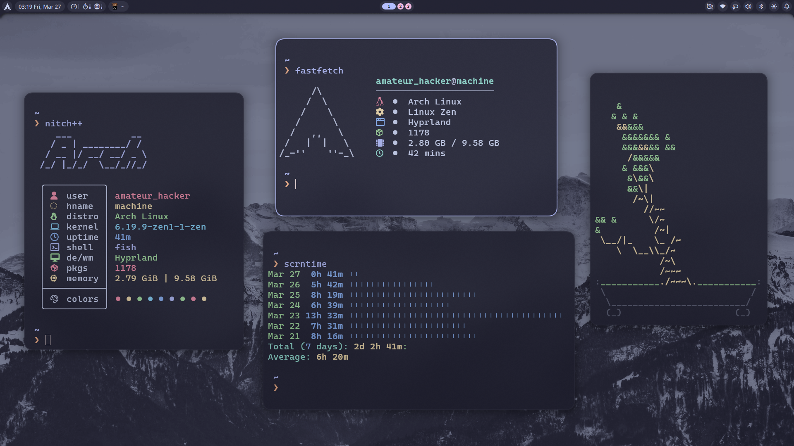
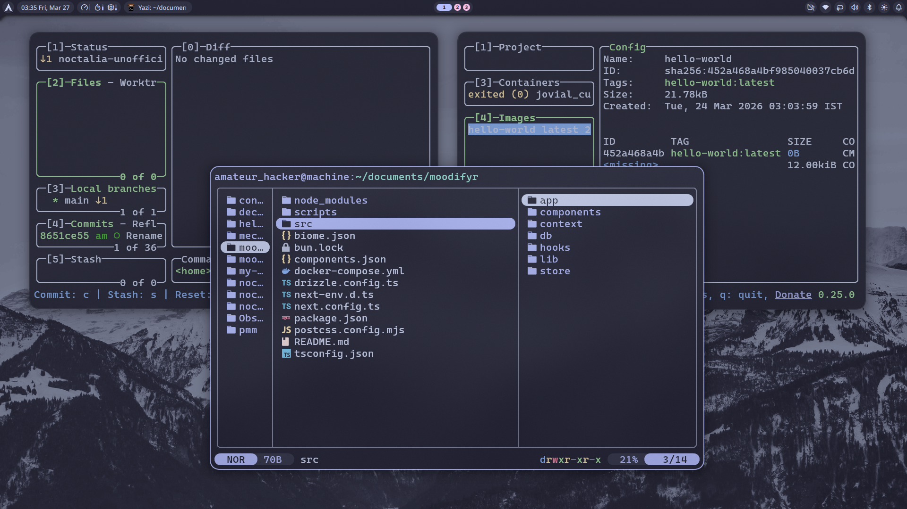
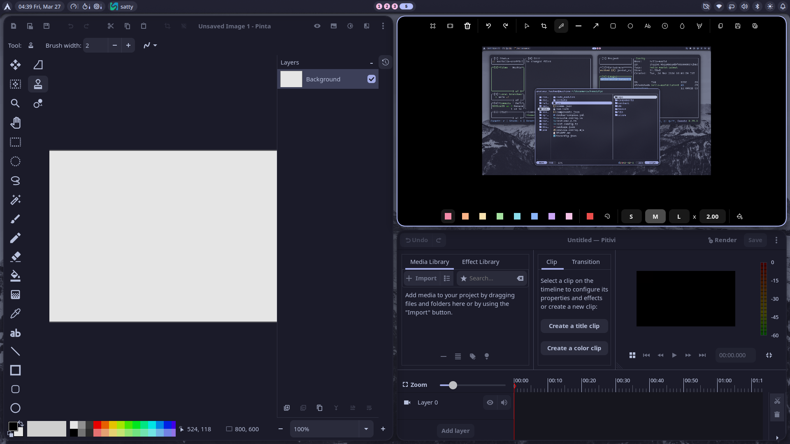
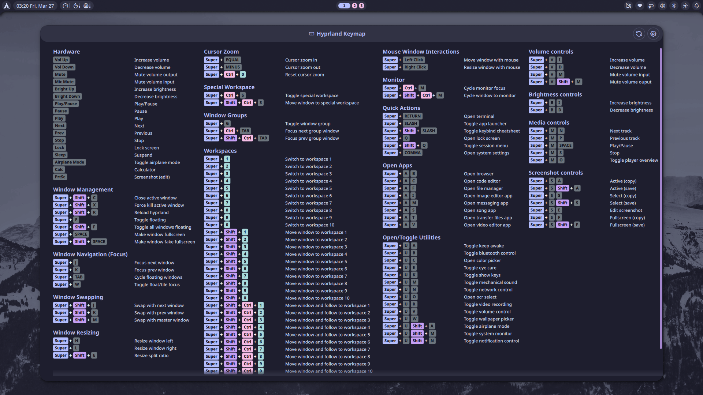

# 🏠 Arch Linux Declarative Config

> A complete, ready-to-use ultimate Arch Hyprland desktop experience.

## ❓ Why This?

If you've ever spent days—or even weeks, or even years—configuring your Linux desktop just the way you like it, only to realize you'd have to do it all over again on a fresh install, this project is for you.

I've been there. Every time I reinstalled, I'd forget which packages I needed, which dotfiles had my essential configs, which scripts made my workflow smoother. Half the things were documented, half weren't. It was always a gamble.

You might ask: "Why not NixOS?" Fair question—NixOS is the king of declarative Linux. But the truth is, it's a steep learning curve. You have to learn Nix, write everything in Nix (dotfiles, configs, packages), and it forces you into its ecosystem. It's powerful, but it takes time to master.

This project gives you the best of both worlds: a declarative, reproducible system that you can apply in just two commands—without the Nix learning curve. You still use Arch Linux the way you know it, with regular config files, but they're applied automatically and declaratively.

No more hunting through notes, no more "I think I had this setting somewhere."

This setup is perfect for developers, content creators, gamers, power users, or anyone who just wants a productive desktop without the hassle. For gamers: required libraries and hardware drivers are installed automatically—just add your games later.

## 📋 Prerequisites

A fresh Arch Linux installation (using archinstall or manual install) with the following settings:

- **Bootloader:** GRUB
- **Filesystem:** BTRFS
- **Kernel:** Linux Zen
- **Network:** NetworkManager
- **Desktop Environment:** None (we'll install Hyprland)

After the base install is done, everything else is handled by this declarative configuration.

## ⚙️ Before You Begin

After cloning the repository, make these adjustments:

### 1. Edit Variables

Open variables.py and update these values

- `FULL_NAME` - Your display name
- `GIT_USER_NAME` - Your Git username
- `GIT_USER_EMAIL` - Your Git email
- `SHELL` - Your default user shell
- `ENABLE_GAME_SUPPORT` - Set to `True` if you need gaming libraries

### 2. Configure Hyprland (Optional)

If you have an **NVIDIA GPU**, uncomment these in `dotfiles/config/hypr/configs/env-variables.conf`:

```bash
env = LIBVA_DRIVER_NAME,nvidia
env = __GLX_VENDOR_LIBRARY_NAME,nvidia
env = __NV_PRIME_RENDER_OFFLOAD,1
env = __VK_LAYER_NV_optimus,NVIDIA_only
env = GSK_RENDERER,ngl
```

If you're on a **desktop (not laptop)**, comment out these imports in `dotfiles/config/hypr/hyprland.conf`:

```bash
# source=$configs/laptop.conf          # Comment out
# source=$configs/laptop-display.conf  # Comment out
```

## 🚀 Quick Start

```bash
# Step 1: Run initial setup (installs decman, AUR helper, etc.)
./initial-setup.sh

# Step 2: Apply the configuration (variables.py should already be edited from Before You Begin)
sudo decman --source main.py

# Step 3: REBOOT your system
sudo reboot

# Step 4: Explore more options
decman --help
```

## ✨ Features

- **Declarative Package Management** — Define packages in Python, decman handles installation
- **Declarative Dotfile Management** — Symlink/copy 150+ dotfiles from repo to system
- **Full Hyprland Desktop** — Wayland compositor with noctalia shell, ergonomic keybinds
- **Complete Theming** — Catppuccin Mocha everywhere: SDDM, GRUB, Plymouth, GTK, Qt, cursors, icons, apps
- **Development Stack** — Node.js, Python, Rust, Go, Bun, Julia, PHP, Ruby + Docker + Lazygit + Lazydocker
- **Productivity Apps** — Chrome, Spotify, LibreOffice, Ferdium, Pinta, Pitivi, Neovide, Opencode etc...
- **Additional Features** — OCR, Mechanical sound, Show keys, Screenshot annotation, Video recording

## 📸 Screenshots






## 📂 Project Structure

```
.
├── main.py                  # Entry point — decman source file
├── profiles.py              # Profile definitions
├── types.py                 # Share type definitions
├── variables.py             # User settings
├── logging_config.py        # Logging setup
├── modules/                 # Package & dotfile modules
│   ├── aur.py               # AUR packages
│   ├── base.py              # Base system packages
│   ├── cli_tools.py         # CLI tools
│   ├── dev_tools.py         # Development tools
│   ├── dotfiles.py          # Dotfile management
│   ├── external_pkgs.py     # External package management
│   ├── fonts.py             # Fonts
│   ├── gui_apps.py          # GUI applications
│   ├── hardware.py          # Hardware drivers
│   ├── hyprland_wm.py       # Hyprland compositor
│   ├── noctalia_shell.py    # Noctalia shell
│   ├── systemd_services.py  # Systemd services
│   ├── theming.py           # Themes
│   ├── wayland_tools.py     # Wayland Utilities
│   └── users.py             # User management
└── dotfiles/                # Source dotfiles
    ├── config/              # ~/.config files
    ├── etc/                 # /etc files
    └── home/                # ~/ files
```

## 📦 Adding Packages

Edit any module in `modules/` — for example, to add packages to CLI tools:

```python
# modules/cli_tools.py
PKGS: PkgList = [
    ("zoxide", ["fzf"]), # Package with deps
    "pipes.sh",  # AUR package support
    CustomPackage(
        "nitch++-git",
        "https://github.com/amateur-hacker/nitchplusplus",
    ),  # Custom Package support
    "new_package"  # Add your package here
]
```

Package format:

- `"package"` — single package
- `("package", ["dep1", "dep2"])` — package with dependencies
- `("package", [("dep1", ["deps1", "deps"]), "dep2"])` — nested deps

## 📁 Adding Dotfiles

Edit `modules/dotfiles.py` — use the module-level variables:

```python
# modules/dotfiles.py

# Copy files to system locations (/etc, /usr, etc.)
FILE_ITEMS: DotfileItemList = [
    ("/etc/default/grub", "etc/default/grub"),
    ("/etc/pacman.conf", "etc/pacman.conf"),
    # (destination, source) or (destination, source, owner)
]

# Copy directories to system
DIRECTORY_ITEMS: DotfileItemList = [
    ("/usr/share/plymouth/themes/anonymous", "usr/share/plymouth/themes/anonymous"),
]

# Create symlinks in user's home directory
SYMLINK_ITEMS: DotfileItemList = [
    (f"{HOME}/.config/hypr", "config/hypr"),
    (f"{HOME}/.config/kitty", "config/kitty"),
    # (destination, source) — destination is relative to home
]

# Run commands when tracked files change (by hash)
TRACKED_ITEMS: TrackedItemsMap = {
    "/etc/default/grub": {
        "key": "grub_hash",
        "action": generate_grub_config,  # function that runs grub-mkconfig
    },
    "/etc/fonts/local.conf": {
        "key": "fonts_hash",
        "action": build_font_cache,  # function that runs fc-cache
    },
}
```

Dotfile format:

- `(destination, source)` — destination: absolute path, source: relative to `dotfiles/`
- `(destination, source, owner)` — with specific owner

> **Note:** For symlinks, if a folder already exists at the destination, remove it first before running decman — otherwise it will warn you.

## 🔧 Creating a New Module

```python
# modules/my_module.py
import decman
from decman.plugins import pacman, aur
from decman.plugins.aur import CustomPackage

from specs import PkgList

from .utils import resolve_pkgs, split_pkgs

PKGS: PkgList = [
    "pacman_pkg1",
    (
        "pacman_pkg2",
        [
            "deps1",
            "deps2",
        ],
    ),
    "aur_pkg1",
    ("aur_pkg2", ["deps1"]),
    CustomPackage("pkg_name", "git_url"),
    (
        CustomPackage("pkg_name", None, "path"),
        [
            "deps1",
            "deps2",
        ],
    ),
]


class MyModule(decman.Module):
    """Description of what this module does."""

    def __init__(self):
        super().__init__("my-module")

        _resolved_pkgs = resolve_pkgs(PKGS)
        # Use _, if you don't want any field.
        self._pkgs, self._aur_pkgs, self._aur_custom_pkgs = split_pkgs(_resolved_pkgs)

    @pacman.packages
    def pkgs(self):
        return self._pkgs

    @aur.packages
    def aur_pkgs(self):
        return self._aur_pkgs

    @aur.custom_packages
    def aur_custom_pkgs(self):
        return self._aur_custom_pkgs
```

Export the module in `modules/__init__.py`, then add it to `profiles.py` or `main.py`.

```python
# profiles.py
from modules import MyModule
from specs import Profile, ProfileModules, ProfilesMap

WORKSTATION: ProfileModules = [
    ...,
    MyModule(),
]


PROFILES: ProfilesMap = {
    Profile.WORKSTATION: WORKSTATION,
}
```

```python
# main.py
from modules import MyModule

decman.modules += [..., MyModule()]
```

## 📦 External Packages

Edit `modules/external_pkgs.py` — define packages for supported package managers:

```python
# modules/external_pkgs.py
EXTERNAL_PACKAGES: ExternalPackages = {
    "bun": [
        "yt-search",
    ],
    "cargo": [
        # ("ripgrep", "--locked"),
    ],
    "pipx": []
}
```

Currently supported package managers: **bun**, **cargo** and **pipx**.

> **Note:** External packages are installed after regular packages. They are managed separately from pacman/AUR packages.
>

## 🔐 Secrets Management

This project supports encrypting sensitive files (SSH keys, API keys) using **sops** and **age**.

### Step 1: Create .sops.yaml Config

Create a `.sops.yaml` file in the secrets folder with your age key:

```bash
# First, generate a key and get its public key
age-keygen -o secrets/keys.txt

# Create .sops.yaml with your public age key
cat > .sops.yaml << 'EOF'
creation_rules:
  - age: your_age_public_key_here
EOF
```

### Step 2: Generate Age Key

```bash
# Encrypt the keys file with a password
age -p -o secrets/sops-keys.txt.age secrets/keys.txt
```

### Step 3: Encrypt SSH Private Key

```bash
# Replace ~/.ssh/id_rsa with your actual private key path
sops -e --input-type binary --output-type binary ~/.ssh/id_rsa > secrets/ssh-id_rsa.enc
```

### Step 4: Add SSH Public Key

Copy your SSH public key to the dotfiles folder for automatic setup:

```bash
mkdir -p dotfiles/home/.ssh
cp ~/.ssh/id_rsa.pub dotfiles/home/.ssh/authorized_keys
```

### Step 5: Encrypt API Keys

```bash
# Create api-keys.yaml with your secrets
cat > secrets/api-keys.yaml << 'EOF'
OPENAI_API_KEY: "sk-..."
GROQ_API_KEY: "gsk_..."
ANTHROPIC_API_KEY: "sk-ant-..."
EOF

# Encrypt the file
sops -e secrets/api-keys.yaml > secrets/api-keys.enc.yaml
```

### Step 6: Clean Up

Remove all unencrypted files from the secrets folder:

```bash
# Keep only: sops-keys.txt.age, ssh-id_rsa.enc, api-keys.enc.yaml
ls -la secrets/
```

### Step 7: Enable Decryption

In `modules/dotfiles.py`, uncomment the decryption functions:

```python
# decrypt_sops_age_key(
#     encrypted_path=Path(self._root) / "secrets/sops-keys.txt.age"
# )
# decrypt_ssh_private_key(
#     encrypted_path=Path(self._root) / "secrets/ssh-id_rsa.enc"
# )
```

### Usage

Decrypt and read API keys on demand:

```bash
sops -d secrets/api-keys.enc.yaml | yq -r '.OPENAI_API_KEY'
```

## 💻 Useful Commands

| Command | Description |
|---------|-------------|
| `decman --dry-run` | Preview changes without applying |
| `decman --debug` | Show debug output |
| `decman --skip files` | Skip dotfiles step |
| `decman --only aur` | Only run AUR packages |
| `decman --params aur-upgrade-devel` | Upgrade devel packages (*-git, etc.) |
| `decman --params aur-force` | Force rebuild cached AUR packages |

## 💡 Bonus: Want to Theme Other Apps?

This setup uses the Catppuccin Mocha palette throughout. If you want to theme additional apps not included here, check out [Catppuccin Ports](https://catppuccin.com/ports/) — they have themes for almost every popular app out there.
